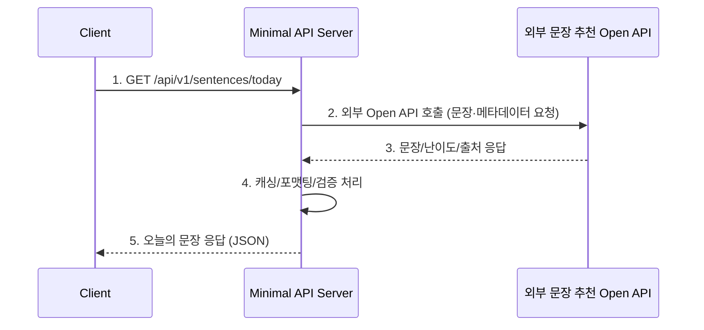

# Minimal Project API 초기 설계

## 오늘의 한문장 추천 API

### 인터랙션 다이어그램


### 요청/응답 초안
- **HTTP Method**: `GET`
- **Endpoint**: `/api/v1/sentences/today`
- **Query Params**: `locale`, `level` 등 선택 옵션 (선택)
- **Success Response (200)**:
  ```json
  {
    "sentence": "Practice makes perfect.",
    "translation": "연습은 완벽을 만든다.",
    "source": "Open Language API",
    "level": "B1",
    "retrievedAt": "2025-11-13T02:30:00Z"
  }
  ```
- **Failure Response (5xx)**: 외부 API 장애 시 캐시 fallback 또는 오류 코드 반환

### 설계 메모
- 서버 내에서 외부 API 호출 결과를 캐시(예: Redis)해 재호출 최소화
- 장애 시 이전 문장 fallback 또는 기본 안내 메시지 제공
- 향후 관리자 콘솔에서 문장을 사전 등록 후 외부 API와 하이브리드 운영 가능